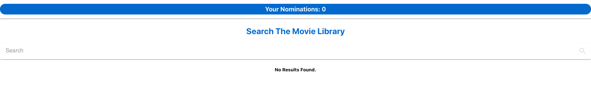
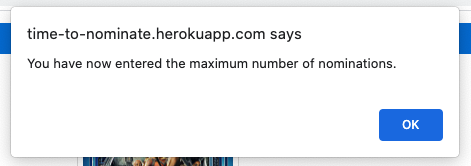

# Time-To-Nominate

This is my Shopify Front-End Engineering Intern project submission (Fall 2021): a webpage which searches [OMDB](http://www.omdbapi.com/) for movies, and allows the user to save their favourite films they feel should be up for nomination (upcoming Shoppies Awards!)

**Deployed On:** http://time-to-nominate.herokuapp.com/

*Note: The site may take some time to load due to Heroku free hosting*

## Table of Contents

1. [Quick Start](#quick-start)
2. [Demo](#demo)
3. [Tech Stack](#tech-stack)

## Quick Start

There are two ways you can visit and interact with the website.

### Option 1
Visit the [deployed site](http://time-to-nominate.herokuapp.com/) (as mentioned above)

### Option 2
Run the site locally (on your local machine)

1. Clone the repository: `git clone https://github.com/aashrit-luthra/Time-To-Nominate.git`
2. In your Terminal, `cd` into this project folder
3. Type and enter `npm install` (this installs the required dependencies)
4. To run the project, type and enter `npm run start` (this will open the site running on your local machine automatically)

## Demo

You will first be faced with a clean UI, showing you:
* your nomination count on the top of the page
* a search bar to search for your favourite movies
* an area to show the search results

You can enter any search query in the search bar, which will then display the movie results (title, year, and poster) alongside a intuitive green button to nominate that movie

Clicking the green 'Nominate' button will add the movie to your nomination list. 
*Observe how the button disables and turns grey once it is nominated*

Once you nominate 5 movies (the maximum number), you will be alerted and informed:

*Observe that all movie 'Nominate' buttons are disabled and greyed due to the limit of nominations being reached* You can also remove nominations by clicking the red 'Remove' button.

## Tech Stack

For this project, I leveraged:

* JavaScript
* React
* Material UI
* HTML
* CSS

